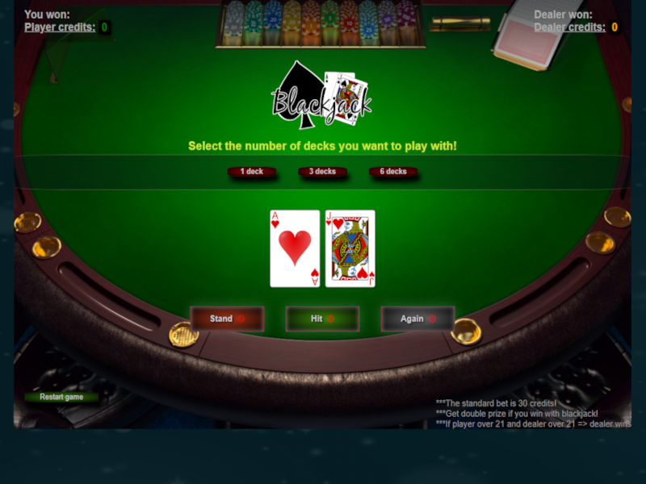

# Blackjack game

- Check live game here => https://claudesblackjack.netlify.app/


## What it is

- After diving into JavaScript this is the first project that I undertook with the purpose of designing and coding a fully mobile-responsive and functioning BlackJack game

- One page app built using JavaScript, HTML, CSS(Flexbox) and DOM manipulation techniques.
- Used only vanilla JS(even before I learned ES6) and this is where I fell in love with JavaScript.



# Technologies and tools used:
- HTML 
- CSS/Flexbox 
- JavaScript
- The project is deployed on Netlify, via GitHub


### Some interesting functions used:

- I consider the cardCalc() function(on line 195 in sripts.js) the main engine of the game where the new drawn cards are calculated and the decision of what to render on the screen is made.
- Deck shuffling:

```javascript
// shuffle deck function
// takes an array of objects as argument and mixes the items several time
function shuffleArray(array) {
    for (var i = array.length - 1; i > 0; i--) {
        var j = Math.floor(Math.random() * (i + 1));
        var temp = array[i];
        array[i] = array[j];
        array[j] = temp;
    }
    return array;
}
```
- The dealer card that is turned is actually drawn in order and fliped on dealer's turn:
```javascript
//function to create a fliped card:
//  draw a card from the deck
// store the atributes of the card
// show the backOfCard image instead of the real URL
function createFlipedCard(){
    if(deck.length < 1){
        createDeck(suitsArr,rankArr,sizeOfDeck);
        messageText.innerText = "A new deck has been created!";
    }
    let flipDrawn = deck.pop();
    backOfCardValue = flipDrawn.value;
    backOfCardUrl = flipDrawn.url;
    dealerCards.innerHTML += ``;
}
```

- Some DOM manipulation at the start of the game:
```javascript
welcome.remove();
    startButton1.remove();
    startButton2.remove();
    startButton3.remove();
    dealerCards.innerHTML = '';
    messageText.innerText = "Good Luck!";
    bottomText = createText('div',`playing with ${decksText} of cards`,'bottom2');
    table.appendChild(bottomText);
    dealerPoints = createText('p','','dealerPoints');
    let dealerHas = createText('p','Dealer has:','dealerHas');
    dealerText.appendChild(dealerHas);
    dealerText.appendChild(dealerPoints);
```


